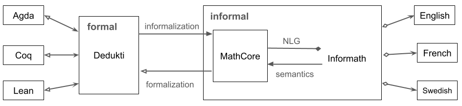

# Informath: Informalization and Autoformalization of Formal Mathematics

(c) Aarne Ranta 2025-2026

[Code repository](https://github.com/GrammaticalFramework/informath)

## NEWS

12 January 2026: a very rudimentary proof-of-concept [Dedukti implementation](./test/natural_deduction.dk) and [GF grammar](./grammars/NaturalDeduction.gf) for natural deduction proofs. You can test this with `make natural_deduction`.

19 December 2025: paper [Multilingual Autoformalization via Fine-tuning Large Language Models with Symbolically Generated Data](https://epub.jku.at/doi/10.35011/risc-proceedings-scml.1) appeared. Its focus is on the use of Informath in training data generation.

24 November 2025: The "-next" version is now default and "-previous" must be invoked with a flag. The previous version will be deprecated very soon, as all its functionality is available in the default version.

## Documentation

[Video from MCLP conference at Institut Pascal, Paris Saclay, September 2025](https://www.youtube.com/watch?v=9puGzYqta7Y&list=PLaT9F1eDUuN0FJAONMXxdGJrGGg2_x9Wb&index=4)

[Updated slides shown in Saclay, Prague, and some other places in 2025](./doc/dedukti-gf-2025.pdf)

[InformathAPI haddock-generated documentation](https://grammaticalframework.github.io/informath/doc/InformathAPI.html)

[Symbolic Informalization: Fluent, Productive, Multilingual](https://aitp-conference.org/2025/abstract/AITP_2025_paper_4.pdf) (by A. Ranta, AITP-2025, extended abstract)

[Multilingual Autoformalization via Fine-tuning Large Language Models with Symbolically Generated Data](https://epub.jku.at/doi/10.35011/risc-proceedings-scml.1), by Pei Huang, Nicholas Smallbone and Aarne Ranta, SCML Vol. 1, 2025.


## The Informath project

The Informath project addresses the problem of translating between formal and informal languages for mathematics. It aims to translate between multiple formal and informal languages in all directions: 

- formal to informal (informalization)
- informal to formal (autoformalization)
- informal to informal (translation, via formal)
- formal to formal (works in special cases)

The formal languages included are Agda, Rocq (formerly Coq), Dedukti, and Lean. The informal languages are English, French, German, and Swedish. Here is an example:

Here is an example statement involving all of the currently available languages. The Dedukti statement has been used as the source of all the other formats. Also any of the natural languages could be used as a source:
```
Dedukti: prop110 : (a : Elem Int) -> (c : Elem Int) ->
  Proof (and (odd a) (odd c)) ->
  Proof (forall Int (b => even (plus (times a b) (times b c)))).

Agda: postulate prop110 : (a : Int) -> (c : Int) ->
  and (odd a) (odd c) ->
  all Int (\ b -> even (plus (times a b) (times b c)))

Rocq: Axiom prop110 : forall a : Int, forall c : Int,
  (odd a /\ odd c -> forall b : Int, even (a * b + b * c)) .

Lean: axiom prop110 (a c : Int) (x : odd a ∧ odd c) :
  ∀ b : Int, even (a * b + b * c)
```

- English: Prop110. Let $a$ and $c$ be integers. Assume that both $a$ and $c$ are odd. Then $a b + b c$ is even for all integers $b$.

- French: Prop110. Soient $a$ et $c$ des entiers. Supposons qu'et $a$ et $c$ sont impairs. Alors $a b + b c$ est pair pour tous les entiers $b$.

- German: Prop110. Seien $a$ und $c$ ganze Zahlen. Nimm an, dass sowohl $a$ als auch $c$ ungerade ist. Dann ist $a b + b c$ gerade für jede ganze Zahl $b$.

- Swedish: Prop110. Låt $a$ och $c$ vara heltal. Anta att både $a$ och $c$ är udda. Då är $a b + b c$ jämnt för alla heltal $b$.


More formalisms and informal languages will be added later. Also the scope of language structures is at the moment theorem statements and definitions; proofs are included for the sake of completeness, but will require more work to enable more natural verbalizations.


## Using Informath

The software included in this repository supports the translation of text and code files in batch mode. For a quick start, you can just do
```
  $ make
```
to build `RunInformath` and all its dependencies. After that, you can do
```
  $ make demo
```
which illustrates different functionalities: translating between Dedukti and natural languages, as well as from Dedukti to Agda, Rocq, and Lean. 

Building the system requires the following software:

- [GF](https://www.grammaticalframework.org/) >= 3.12 (both as executable and as the PGF library)
- [GF-RGL](https://github.com/GrammaticalFramework/gf-rgl) (the Resource Grammar Library, to be compiled from its GitHub source)
- [BNFC](https://bnfc.digitalgrammars.com/) >= 2.9 (executable)
- [GHC](https://www.haskell.org/ghcup/) >= 9.6 (executable, with some common libraries)
- [alex](https://www.haskell.org/alex/) (executable, tested with 3.5.4)
- [happy](https://www.haskell.org/happy/) (executable)


## Some test datasets

The following datasets can be processed with `RunInformath <filename>` to generate text or code eveb without additional options; see `RunInformath -help` to see what can be done with various options.

- [test/exx.dk](./test/exx.dk) is a set of simple arithmetic statements.

- [test/gf-lean.data](./test/gflean-data.txt) is a set of arithmetic statements in natural language, extracted from a textbook in Shashank Pathak's GFLean project.

- [test/naproche-zf-set.tex](./test/naproche-zf-set.tex) is a set of Naproche-ZF statements. Try `make naproche` to directly display a LaTeX document. Use `make lang=Fre naproche` to generate French (and similarly for Ger, Swe).

- [test/sets.dk](./test/sets.dk) contains set algebra statements from a Wikipedia article. Try `make sets` to directly display a LaTeX document. Use `make lang=Fre sets` to generate French (and similarly for Ger, Swe).

- [test/sigma.dk](./test/sigma.dk) contains some examples of variable-binding constructs (sums, integrals). Try `make sigma` to directly display a LaTeX document.

- [test/top100.dk](./test/top100.dk) contains a selection of Wiedijk's "100 theorems". Try `make top100` to directly display a LaTeX document. Use `make lang=Fre top100` to generate French (and similarly for Ger, Swe).

## Your own data

You can in principle generate from any Dedukti (`.dk`) file, at least if it is well typed in Dedukti (which is not always necessary). However, the result will be quite bad unless you provide a symbol table with a `.dkgf` file, converting Dedukti identifiers to GF functions; see below about the structure of this file. 

There is a default symbol table, which works for the examples listed above. But for other Dedukti files, it can give strange results or even processing errors because of name clashes between that file and the default symbol table. The first aid to this is to use the empty symbol table, by passing it to the flag `-constants`. An example is the conversion of a Matita dump:
```
  $ RunInformath -constants=test/empty.dkgf test/mini-matita.dk
```


## Generating synthetic data

For those who are interested just in the generation of synthetic data, the following commands (after building Informath with `make`) can do it: assuming that you have a `.dk` file available, build a `.jsonl` file with all conversions of each Dedukti judgement:
```
  $ RunInformath -parallel-data <file>.dk > <file>.jsonl
```
After that, select the desired formal and informal languages to generate a new `.jsonl` data with just those pairs:
```
  $ python3 ./scripts/jsonltest.py <file.jsonl> <formal> <informal>
```
The currently available values of `<formal>` and `<informal>` are the keys in `<file>.jsonl` - for example, `agda` and `InformathEng`, respectively.


## The files in this repository

The [`src`](./src/) directory contains
- Haskell and other sources
- subdirectory in [typetheory](./src/typetheory/) with generated parser and printer for the proof systems [Dedukti](https://deducteam.github.io/), Agda](https://wiki.portal.chalmers.se/agda/pmwiki.php), [Rocq](https://rocq-prover.org/), and [Lean](https://lean-lang.org/) 
- a translator from MathCore to Dedukti and vice-versa
- translations between MathCore and Informath
- file [BaseConstants.dk](./src/BaseConstants.dk) of logical and numeric operations assumed in most of the data examples, and correspoonding files for Agda, Rocq, and Lean
- file [baseconstants.dkgf](./src/baseconstants.dkgf), a symbol table for converting Dedukti constants in BaseConstants.dk to GF abstract syntax functions

The [`test`](./test/) directory contains
- some test data as `.dk`, `.tex`, and `.txt` files (see above)

The [`grammars`](./grammars) directory contains

- [MathCore](./grammars/MathCore.gf), the abstract syntax of a minimal CNL for mathematics
- [MathCoreEng](./grammars/MathCoreEng.gf), Fre, Ger, Swe - concrete syntaxes of MathCore 
- [MathExtensions(./grammars/MathExtensions.gf), an extension of MathCore with alternative expressions, and corresponding concrete syntaxes
- [VerbalConstants](./grammars/VerbalConstants.gf), lexicon of natural language mathematical concepts
- [SymbolicConstants](./grammars/SymbolicConstants.gf), lexicon of symbolic concepts in LaTeX.
- [Terms](./grammars/Terms.gf), grammar of formal notations, with a single concrete syntax [TermsLatex](./grammars/TermsLatex.gf)
- [UserExtensions](./grammars/UserExtensions.gf), user-definable extension modules, such as Naproche and NaturalDeduction
- [Utilities](./grammars/Utilities.gf), auxiliary functions and type synonyms used in other modules, also usable in user extensions
- [Informath](./grammars/Informath.gf), the top module that puts everything together

The [`scripts`](./test/) directory contains
- Python scripts for various related tasks


## The structure of Informath

The structure of Informath is shown in the following picture:



The diagram has four kinds of arrowheads. Solid ones mean that the operation is a total function, giving exactly one result for every input (triangular arrowheads) or possibly many (diamond). Hollow arrowheads mean partial functions which can give many results to some input:

 - Conversions from Dedukti to Agda, Rocq, and Lean are partial, because Dedukti is more permissive than these formalisms (see Section ? below).
 - Conversion from MathCore to Dedukti may fail because MathCore is more permissive than Dedukti; this is because we delegate dependent type checking to Dedukti.
 - Conversion from MathCore to Informath is one-to-many, and always results in at least one value, the MathCore expression itself.
 - Conversions from English and other natural languages to Informath may fail, because the input is not covered by the grammar. They can also give many results, because the grammar accepts ambiguity; the idea is that ambiguity is ultimately checked on semantic grounds in Dedukti.

Conversions between MathCore and Informath, and extending the Informath language itself, are the most open-ended parts of the project and hence the main research focus. Conversions from Dedukti to Agda, Coq, and Lean and back are mostly engineering (although tricky in some cases) and has to a large extent been done for the kind of code needed in Informath. Conversions from these type theories to Dedukti rely on already existing third-party tools. Those tools are not always up to date with the latest versions of the systems, but they have their own development teams that have goals independent of Informath.

### Dedukti

[Dedukti](https://deducteam.github.io/) is a minimalistic logical framework aimed as an interlingua between different proof systems such as Agda, Rocq (formerly Coq), Isabelle, and Lean.
Its purpose is to help share formalizations between these systems.
Dedukti comes with an efficient proof checker and evaluator.
Translations from many other proof system to Dedukti have been built, and this work is ongoing.

Technically, Dedukti is described as an implementation of Lambda-Pi-calculus with rewrite rules.
It is similar to Martin-Löf's logical framework from the 1980's, except for a more liberal syntax of rewrite rules.
Thereby, it is also similar to the ALF system of 1990's and to the abstract syntax of GF, Grammatical Framework.

Due to its simplicity and expressivity, together with an existing implementation and conversions, we have chosen Dedukti as the interlingua for other proof systems.

### Agda, Rocq, and Lean

Agda, Rocq, and Lean are type-theoretical proof systems just like Dedukti. But all of them have a richer syntax than Dedukti, because they are intended to be hand-written by mathematicians and programmers, whereas Dedukti has an austere syntax suitable for automatic generation for code.

Translators from each of Agda, Rocq, and Lean to Dedukti are available, and we have no plans to write our own ones. However, translators from Dedukti to these formalisms are included in the current directory. They are very partial, because they only have to target fragments of the Agda, Rocq, and Lean. This is all we need for the purpose of autoformalization, if the generated code is just to be machine-checked and not to be read by humans.

However, if Informath is to be used as an input tool by Agda, Rocq, and Lean users, nice-looking syntax is desirable. In the case of Rocq and Lean, we have tried to include some syntactic sugar, such as infix notations. In Agda, this has not yet been done, because its libraries and the syntactic sugar defined in them are not as standardized as in Rocq and Lean.

Another caveat is that Dedukti is, by design, more liberal than the other systems. Type checking of code generated from type-correct Dedukti code can therefore fail in them. This can sometimes be repaired by inserting extra code such as coercions, but this is still mostly future work.

If you want to check the formal code in any of the proof systems, you must also install them. Informath itself does not require them, but at least Dedukti is useful to have so that you can check the input and output Dedukti code.

- [Dedukti](https://github.com/Deducteam/Dedukti)
- [Agda](https://agda.readthedocs.io/en/latest/getting-started/installation.html)
- [Rocq](https://rocq-prover.org/)
- [Lean](https://leanprover-community.github.io/get_started.html)


### The MathCore language

The MathCore language is meant to be the "core abstract syntax" in Informath. Technically, it is actually a subset of Informath: Informath is implemented as an extension of MathCore.

As shown in the picture above, informalization and autoformalization are in the first place defined between Dedukti and MathCore. On the type theory side, this is composed with translations between other frameworks and Dedukti. On the natural language side, mappings between MathCore and the full Informath are defined on the abstract syntax level of these languages. Input and output of actual natural languages is performed by generation and parsing with concrete syntaxes of each language.

MathCore is a minimalistic grammar for mathematical language, based on the following principles:

- **Completeness**: all Dedukti code can be translated to MathCore.
- **Non-ambiguity**: all MathCore text has a unique translation to Dedukti.
- **Losslessness**: MathCore is a lossless representation of Dedukti; that is, all Dedukti code translated to MathCore can be translated back to the same Dedukti code (modulo some differences to be specified).
- **Traceability**: Dedukti code and MathCore text can be aligned part by part.
- **Grammaticality**: MathCore text is grammatically correct natural language (with mathematical symbols and some mark-up such as parentheses to prevent ambiguity).
- **Naturalness**: MathCore supports natural expressions for mathematical concepts using nouns, adjectives, verbs, and other structures conventionally used in mathematical text.
- **Minimality**: MathCore is defined to have exactly one way to express each Dedukti judgement. Alternative ways are provided in Informath via NLG. Typically, the unique way is the most straightforward one. For example, complex mathematical expressions are given in their verbal forms ("the sum of x and y") rather than formulas ("x + y"), because formulas are not available when any of the constituents if not formal ("x + the successor of y").
- **Extensibility**: MathCore can be extended with lexical information assigning natural language verbalizations to Dedukti identifiers.
- **Multilinguality**: MathCore has been implemented by GF RGL and is therefore ready for concrete syntax in new languages.

The following propertes are, however, *not* expected:

- **Type correctness**: MathCore text can be semantically invalid, leading to syntactically correct Dedukti code that is rejected by Dedukti's type checker.
- **Fluency**: MathCore text can be repetitive and hard to read; making it better is delegated to the Informath grammar via the NLG component.
- **Compositionality**: The translation between Dedukti and MathCore is not compositional in the strict sense of GF, as the two languages have distinxt abstract syntaxes. MathCore has a larger set of syntactic categories than Dedukti, for instance distinguishing between expressions that represent kinds, objects, propositions, and proofs.
- **Easy natural language input**: while the grammar of MathCore is reversible, it is tedious to write MathCore. It is intended to be produced indirectly: by conversion from Dedukti on one hand and from Informath on the other.

The rationale of this design is modularity and an optimal use of existing resources:

- Type checking is delegated to Dedukti.
- Conversions to different frameworks are also delegated to Dedukti.
- Variation of natural language input and output is delegated to Informath.


### The full Informath language

While being inspired by CNLs such as ForTheL and Naproche, covering a similar fragment of English, the Informath grammar differs from the original them in several ways:

- **Grammaticality**: Informath follows the agreement rules of English (and other languages) instead of allowing free variation of e.g. singular and plural forms (as ForTheL and early versions of Naproche); this makes it more usable as the target of informalization.
- **Ambiguity**: CNLs prevent syntactic ambiguities by means of devices such as brackets and precedence rules. Informath tries to capture all syntactic ambiguities that exist in natural language, and delegates it to the logical framework to resolve them by semantic clues. This is in line with the findings in [*The language of Mathematics*](https://link.springer.com/book/10.1007/978-3-642-37012-0) by Mohan Ganesalingam.
- **LaTeX**: The original ForTheL is plain text, whereas Informath (like some other later versions of ForTheL) allows the full use of LaTeX similar to usual mathematical documents; this is one of the
- **Extensions**: Informath is open for extensions with new forms of expression when encountered in mathematical text. In ForTheL, new concepts can be defined, but the overall syntax is fixed. Because of the design of Informath, every extension should be equipped with a new semantic rule that converts it to MathCore.
- **Omissions**: Informath is not guaranteed to cover everything that occurs in different CNLs. In particular, constructs that differ from grammatical English are usually omitted.
- **Multilinguality**: Informath has several concrete syntaxes sharing a common abstract syntax.

### An example of variations

Consider again the example Dedukti statement used above:
```
Dedukti: prop110 : (a : Elem Int) -> (c : Elem Int) ->
  Proof (and (odd a) (odd c)) ->
  Proof (forall Int (b => even (plus (times a b) (times b c)))).
```
The MathCore informalization (in English) is one-to-one and verbose:

- Prop110. Let $a$ and $c$ be instances of integers. Assume that we can prove that $a$ is odd and $c$ is odd. Then we can prove that for all integers $b$, the sum of the product of $a$ and $b$ and the product of $b$ and $c$ is even.

MathCore renderings are designed to be unique for each Dedukti judgement. But the full Informath language recognizes several variations. Here are some of them for English, as generated by the system; other languages have equivalents of each of them:

- Prop110. For all integers $a$ and $c$, if $a$ is odd and $c$ is odd, then for all integers $b$, $a b + b c$ is even.
- Prop110. Let $a$ and $c$ be integers. Then if $a$ is odd and $c$ is odd, then for all integers $b$, $a b + b c$ is even.
- Prop110. Let $a , c \in Z$. then if $a$ is odd and $c$ is odd, then for all integers $b$, $a b + b c$ is even.
- Prop110. Let $a$ and $c$ be integers. Assume that $a$ is odd and $c$ is odd. Then for all integers $b$, $a b + b c$ is even.
- Prop110. Let $a , c \in Z$. assume that $a$ is odd and $c$ is odd. Then for all integers $b$, $a b + b c$ is even.
- Prop110. For all integers $a$ and $c$, if both $a$ and $c$ are odd, then for all integers $b$, $a b + b c$ is even.
- Prop110. Let $a$ and $c$ be integers. Then if both $a$ and $c$ are odd, then for all integers $b$, $a b + b c$ is even.
- Prop110. Let $a , c \in Z$. then if both $a$ and $c$ are odd, then for all integers $b$, $a b + b c$ is even.
- Prop110. Let $a$ and $c$ be integers. Assume that both $a$ and $c$ are odd. Then for all integers $b$, $a b + b c$ is even.
- Prop110. Let $a , c \in Z$. assume that both $a$ and $c$ are odd. Then for all integers $b$, $a b + b c$ is even.
Prop110. Let $a , c \in Z$. assume that both $a$ and $c$ are odd. Then $a b + b c$ is even for all integers $b$.


## User-defined extensions

_Under construction, may work in a different way in the future._

The lexicon part part of the GF grammar (files grammars/VerbalConstants*, SymbolicConstants*) give verbalizations to defined constants in .dk files.

The mapping between Dedukti and GF is defined in .dkgf files, by default in [baseconstants.dkgf](src/baseconstants.dkgf), which assigns GF functions to the constants in [BaseConstants.dk](src/BaseConstant.dk). The syntax of .dkgf files recognizes three kinds of lines;
- `<DeduktiIdent> <GFFunction>+`: different GF functions usable for expressing the Dedukti concept
- `#CONV <formalism> <DeduktiIdent> <FormalismIdent>`: conversion of Dedukti identifier to another formalism (e.g. its standard library function) 
- `#DROP <DeduktiIdent> <int>`: drop a number of initial arguments from the Dedukti function application

The coverage of Informath can be extended by writing a .dkgf file that maps Dedukti identifiers to GF functions. If those GF functions are already availeble, nothing else is needed than the inclusion of the flag `-constants=<file>.dkgf+` where `base_constants.dkgf`can be one of the files.

If new GF functions are defined, they have to be be included in [`UserExtensions`](./grammars/UserExtensions.gf), preferably via an extra module inherited by it. After that, the GF grammar has to be recompiled by 
```
$ make grammar
```
No recompilation of Haskell files is needed, as long as the UserConstants only include atomic functions of lexical categories, to be listed in next section. 

If other functions are included, both the grammar and the Haskell code can be compiled with the short command
```
$ make devel
```


### Categories of user-defined constants

The following categories of new verbal constants are currently supported by the grammar and listed in `.dkgf` files:
```
  category  semantic type              example
—-----------------------------------------------------------
  Adj       Exp -> Prop                even
  Adj2      Exp -> Exp -> Prop         divisible by
  Adj3      Exp -> Exp -> Exp -> Prop  congruent to y modulo z
  AdjC      Exps -> Prop               distinct (collective pred.)
  AdjE      Exps -> Prop               equal (equivalence rel.)
  Fam       Kind -> Kind               list of
  Fam2      Kind -> Kind -> Kind       function from ... to
  Fun       Exp -> Exp                 the square of
  Fun2      Exp -> Exp -> Exp          the quotient of
  FunC      Exps -> Exp                the sum of
  Label     ProofExp                   theorem 1
  Name      Exp                        the empty set
  Noun      Kind                       integer
  Noun1     Exp -> Prop                (a) prime
  Noun2     Exp -> Exp -> Prop         (a) divisor of
  Verb      Exp -> Prop                converge
  Verb2     Exp -> Exp -> Prop         divide
```
The category `Exps` contains non-empty lists of expressions. In the concrete syntax, the last two are combined with the conjunction "and", and its equivalent in other languages.

Every entry in a `.dkgf` file must have a verbal function as its primary rendering, given right after the Dedukti function. Alternative verbalizations can also come from symbolic categories:
```
  category    semantic type           example
—-------------------------------------------------------------------
  Compar      Term -> Term -> Term    <
  Const       Term                    \pi
  Oper        Term -> Term            \sqrt
  Oper2       Term -> Term -> Term    +
```

### Linearizations of user-defined constants

The easiest way to write linearization rules for constants is to use the `Utulities<Lang>` library module, whose API is given in the interface module [Utilities](./grammars/Utilities.gf). Many categories $C$ have a shortcut function
```
mkC : Str -> C
````
such that, for instance, one can define
```
lin integer_Noun = mkNoun "integer"
lin odd_Adj = mkAdj "odd"
```
However, more information is sometimes needed, particularly in languages other than English. A wider range of `mkC` functions is available for those cases, usually combining morphological functions from the standard RGL library `Paradigms<Lang>`. For instance, a possible rule for rational numbers in French is
```
lin rational_Noun = mkNoun (mkA "rationnel") (mkN "nombre" masculine)
```

### Functions of non-lexical categories

While it would be possible to define lexical categories for all possible semantic types and syntactic forms that appear in mathematics, this would clutter the grammar extensively and, what it worse, compel the user who wants to extend the language also to add compilation cases to the Haskell code. Because of this, Informath is being extended with the possibility to assign GF functions other than lexical ones to Dedukti constants in symbol tables.

These functions operate on the basic types of expressions, which are
```
category   name           linguistic type 
—-------------------------------------------------------------------
Exp        expression.    NP (noun phrase)
Ident      identifier     Symb (symbol)
Kind       kind           CN (commoun noun)
Prop       proposition    S (sentence)
Proof      proof text.    Text
```
One advantage of this extension is that it eliminates the need to hard-code Dedukti identifiers in Haskell code. For example, the logical operators can now be mapped by means of symbol tables. In Dedukti we have
```
and : Prop -> Prop -> Prop.
```
In MathCore, we have
```
CoreAndProp : Prop -> Prop -> Prop
```
The symbol table entry is straightforward:
```
and    CoreAndProp
```
A bit more complicated is the treatment of variable bindings. In Dedukti, we can declare the universal quantifier as follows:
```
forall : (A : Kind) -> (B : ((x : Elem A) -> Prop)) -> Prop.
```
The corresponding GF function flattens the bound variable into an argument on the same level:
```
CoreAllProp : Kind -> Ident -> Prop -> Prop
```
The symbol table entry relies on the correspondance between these types:
```
forall   CoreAllProp
```
This generalization of symbol table is still an experimental feature of Informath.


## Processing in type theory

### Type checking in Dedukti

The type checking is based on the file [BaseConstants.dk](./src/BaseConstants.dk), which is meant to be extended as the project grows. This file type checks in Dedukti with the command
```
  $ dk check BaseConstants.dk
```
The example file [test/exx.dk](./src/test/exx.dk) assumes this file. As shown in `make demo`, it must at the moment be appended to the base file to type check:
```
$ cat BaseConstants.dk test/exx.dk >bexx.dk
$ dk check bexx.dk
```
Since this is cumbersome, we will need to implement something more automatic in the future. We also plan to use Dedukti for type selecting among ambiguous parse results by type checking, and Lambdapi (a syntactically richer version of Dedukti with implicit arguments) to restore implicit arguments.


### Generating other type theories

Each of Agda, Rocq, and Lean will be described below. A common feature to all of them are the conversion rules of constants stored in [BaseConstants.dk](./src/BaseConstants.dk), with the format as in
```
#CONV agda forall all
#CONV rocq forall All
#CONV lean forall All
```
The purpose of these conversions is to
- avoid clashes of the target systems' reserved words
- map Dedukti to standard libraries of these systems
- comply to the identifier syntax of each system

The last purpose might be better served by a generic conversion, but that remains to be done.

### Generating and type checking Agda

There a simple generation of Agda from Dedukti. At the moment, it is only reliable for generating Agda "postulates". The usage is
```
$ RunInformath -to-formalism=agda <file>
```
where the file can be either a .dk or a text file.
As shown by `make demo`, this process can produce valid Agda code:
```
$ RunInformath -to-formalixm=agda test/exx.dk >exx.agda
$ agda --prop exx.agda
```
The base file [BaseConstants.agda](./src/BaseConstants.agda) is accessed by an `open import` statement.

### Generating and type checking Rocq

Generation from Dedukti is similar to Agda, but type checking requires at the moment concatenation with [BaseConstants.v](BaseConstants.v):
```
$ RunInformath -to-formalism=rocq test/exx.dk >exx.v
$ cat BaseConstants.v exx.v >bexx.v
$ coqc bexx.lean
```
This should be made less cumbersome in the future.

### Generating and type checking Lean

Just like in Rocq, type checking requires at the moment concatenation with [BaseConstants.lean](BaseConstants.lean):
```
$ RunInformath -to-formalism=lean test/exx.dk >exx.lean
$ cat BaseConstants.lean exx.lean >bexx.lean
$ lean bexx.lean
```
This should be made less cumbersome in the future.

## ToDo

- improve conversions from Dedukti to other proof systems in particular to guarantee type correctness
- extend the MathCore-Informath conversion
- investigate the possibility of a declarative, user-defined extension of MathCore-Informath conversion
- improve the concrete syntaxes of different languages by functor exceptions
- add concrete syntaxes to yet other natural languages
- extend the Informath language, in particular, with
     - proofs, in addition to theorems and definitions to proofs (complete in theory, but very rudimentary now)
     - wider coverage of BaseConstants.dk and the multilingual lexicon of math terms


