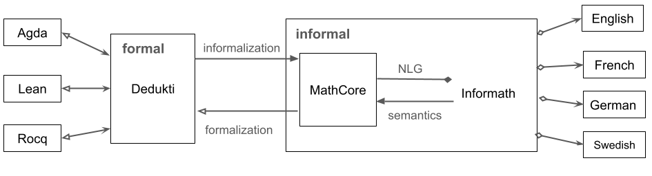

# Informath: Informalization and Autoformalization of Formal Mathematics

(c) Aarne Ranta 2025-2026

[Code repository](https://github.com/GrammaticalFramework/informath)

[Documents in github.io](https://grammaticalframework.github.io/informath/)

#### LATEST NEWS

22 February 2026: a very first attempt at a binary release, starting with MacOS. No need to install Haskell or GF. See below on "Using ready-made binaries".

[Older news](./doc/old-news.md)


## Documentation

This README: using Informath with ready-made binaries and grammars.

[Informath Under the Hood](https://grammaticalframework.github.io/informath/doc/informath-under-the-hood.html). Recommended if you want to change the GF grammar and not just the symbol table.

[Video from MCLP conference at Institut Pascal, Paris Saclay, September 2025](https://www.youtube.com/watch?v=9puGzYqta7Y&list=PLaT9F1eDUuN0FJAONMXxdGJrGGg2_x9Wb&index=4)

[Updated slides shown in Saclay, Prague, and some other places in 2025](./doc/dedukti-gf-2025.pdf)

[InformathAPI haddock-generated documentation](https://grammaticalframework.github.io/informath/doc/InformathAPI.html)

[Symbolic Informalization: Fluent, Productive, Multilingual](https://aitp-conference.org/2025/abstract/AITP_2025_paper_4.pdf) (by A. Ranta, AITP-2025, extended abstract)

[Multilingual Autoformalization via Fine-tuning Large Language Models with Symbolically Generated Data](https://epub.jku.at/doi/10.35011/risc-proceedings-scml.1), by Pei Huang, Nicholas Smallbone and Aarne Ranta, SCML Vol. 1, 2025.


## The Informath project

The Informath project addresses the problem of translating between formal and informal languages for mathematics. It aims to translate between multiple formal and informal languages in all directions: 

- formal to informal (**informalization**)
- informal to formal (**autoformalization**)
- informal to informal (translation, via formal)
- formal to formal (works in special cases)

The formal languages included are Agda, Rocq (formerly Coq), Dedukti, and Lean. The informal languages are English, French, German, and Swedish. 

Here is an example statement involving all of the currently available languages. The Dedukti statement has been used as the source of all the other formats. Also any of the natural languages could be used as the source:
```
Dedukti: prop110 : (a : Elem Int) -> (c : Elem Int) ->
  Proof (and (odd a) (odd c)) ->
  Proof (forall Int (b => even (plus (times a b) (times b c)))).

Agda: postulate prop110 : (a : Int) -> (c : Int) ->
  and (odd a) (odd c) ->
  all Int (\ b -> even (plus (times a b) (times b c)))

Rocq: Axiom prop110 : forall a : Int, forall c : Int,
  (odd a /\ odd c -> forall b : Int, even (a * b + b * c)) .

Lean: axiom prop110 (a c : Int) (x : odd a ∧ odd c) :
  ∀ b : Int, even (a * b + b * c)
```

- English: Prop110. Let $a$ and $c$ be integers. Assume that both $a$ and $c$ are odd. Then $a b + b c$ is even for all integers $b$.

- French: Prop110. Soient $a$ et $c$ des entiers. Supposons qu'et $a$ et $c$ sont impairs. Alors $a b + b c$ est pair pour tous les entiers $b$.

- German: Prop110. Seien $a$ und $c$ ganze Zahlen. Nimm an, dass sowohl $a$ als auch $c$ ungerade ist. Dann ist $a b + b c$ gerade für jede ganze Zahl $b$.

- Swedish: Prop110. Låt $a$ och $c$ vara heltal. Anta att både $a$ och $c$ är udda. Då är $a b + b c$ jämnt för alla heltal $b$.


More formalisms and informal languages will be added later. Also the scope of language structures is at the moment theorem statements and definitions; proofs are included for the sake of completeness, but will require more work to enable more natural verbalizations.


## Using Informath

### From ready-made binaries

*For this method, you don't need GF or Haskell. It should work for ARM-MacOS and hopefully soon for Intel-Linux.*

The quickest way to use Informath is to

- clone this Git repository
- go to the [release page](https://github.com/GrammaticalFramework/informath/releases/tag/informath-0.1)
- download and uncompress the binary `RunInformath` for you OS architecture and put it into some place on your path of executables; rename it to `RunInformath` to remove the OS-specific suffix
- download and uncompress the OS-independent grammar binary `Informath.pgf` and move it to the `share/` directory of thie Git repository
- point the environment variable `INFORMATH_ROOT` to the place where this Git repository is cloned in your system

After that, you can do
```
$ echo "c : Proof (Eq (plus 2 2) 4)." | RunInformath -variations
```
for a very quick example, or
```
  $ make demo
```
for many more examples.


### Compiling from source

If you cannot use a ready-made binary, do
```
  $ make
```
to build the executable `RunInformath` and all its dependencies.
You will need to set the environment variable `INFORMATH_ROOT` to point to the directory where the `share/` directory resides (the same as where this README.md resides).

After that, you can do
```
  $ make demo
```
which illustrates different functionalities: translating between Dedukti and natural languages, as well as from Dedukti to Agda, Rocq, and Lean. 

Building the system from source requires the following software:

- [GF](https://www.grammaticalframework.org/) >= 3.12 (both as executable and as the PGF library)
- [GF-RGL](https://github.com/GrammaticalFramework/gf-rgl) (the Resource Grammar Library, to be compiled from its GitHub source)
- [BNFC](https://bnfc.digitalgrammars.com/) >= 2.9 (executable)
- [GHC](https://www.haskell.org/ghcup/) >= 9.6 (executable, with some common libraries)
- [alex](https://www.haskell.org/alex/) (executable, tested with 3.5.4)
- [happy](https://www.haskell.org/happy/) (executable)


## Some test datasets

The following datasets can be processed with `RunInformath <filename>` to generate text or code eveb without additional options; see `RunInformath -help` to see what can be done with various options.

- [test/exx.dk](./test/exx.dk) is a set of simple arithmetic statements.

- [test/gf-lean.data](./test/gflean-data.txt) is a set of arithmetic statements in natural language, extracted from the textbook [*Mathematical Proofs: A Transition to Advanced Mathematics*](https://pdfcoffee.com/mathematical-proofs-3rd-edition-chartrand-pdf-free.html) by Chartrand et al, used in [Pathak's GFLean project](https://arxiv.org/abs/2404.01234). Some statements in this set are not yet parsed or interpreted correctly.

- [test/naproche-zf-set.tex](./test/naproche-zf-set.tex) is a set of de Lon's [Naproche-ZF](https://adelon.net/naproche-zf) statements. Try `make naproche` to directly display a LaTeX document. Use `make lang=Fre naproche` to generate French (and similarly for Ger, Swe). Some statements are not yet parsed or interpreted correctly.

- [test/sets.dk](./test/sets.dk) contains set algebra statements from a [Wikipedia article](https://en.wikipedia.org/wiki/Algebra_of_sets). Try `make sets` to directly display a LaTeX document. Use `make lang=Fre sets` to generate French (and similarly for Ger, Swe).

- [test/sigma.dk](./test/sigma.dk) contains some examples of variable-binding constructs (sums, integrals). Try `make sigma` to directly display a LaTeX document.

- [test/top100.dk](./test/top100.dk) contains a selection of [Wiedijk's "100 theorems"](https://www.cs.ru.nl/~freek/100/). Try `make top100` to directly display a LaTeX document. Use `make lang=Fre top100` to generate French (and similarly for Ger, Swe).
  
- [datasets/smad.tar.bz2](./datasets/smad.tar.bz2) contains the synthetic data used in the [autoformalization experiment of Huang et al.](https://epub.jku.at/doi/10.35011/risc-proceedings-scml.1)

- [test/natural.tex](./test/natural.tex) contains the manually written top100-statements used for evaluating autoformalization in Huang et al. 


## Possible input and output formats formats

Use `RunInformath -help` to see the actually available file types and extensions. You can also use `RunInformath` on standard input, for instance,
```
$ echo "c : Proof (forall Num (n => if (even n) (not (odd n))))." | RunInformath
C. If $n$ is even, then $n$ is not odd for all numbers $n$.

$ echo "every number is even or odd." | RunInformath -formalize           
noLabel : Proof (forall Num (_h0 => or (even _h0) (odd _h0))) .
```
The option `-loop` allows you to translate between individual Dedukti and natural language judgements:
```
$ RunInformath -loop
> prop1 : Proof (forall Nat (n => if (even n) (not (odd n)))).
Prop1. If $n$ is even, then $n$ is not odd for all natural numbers $n$.
> ? Every number is even or odd.
noLabel : Proof (forall Num (_h0 => or (even _h0) (odd _h0))) .
> 
```
Input prefixed with `?` is treated as natural language, all other input as Dedukti. 
You can change the source and target languages with the `-from-lang` and `-to-lang` flags. 
You can quit the loop with Ctrl-C.

## Generating synthetic data

For those who are interested just in the generation of synthetic data, the following commands (after building Informath with `make`) can do it: assuming that you have a `.dk` file available, build a `.jsonl` file with all conversions of each Dedukti judgement:
```
$ RunInformath -parallel-data <file>.dk > <file>.jsonl
```
After that, select the desired formal and informal languages to generate a new `.jsonl` data with just those pairs:
```
$ python3 ./scripts/jsonltest.py <file.jsonl> <formal> <informal>
```
The currently available values of `<formal>` and `<informal>` are the keys in `<file>.jsonl` - for example, `agda` and `InformathEng`, respectively.

An example is [datasets/smad.tar.bz2](./datasets/smad.tar.bz2), which contains the synthetic data used in the [autoformalization experiment of Huang et al.](https://epub.jku.at/doi/10.35011/risc-proceedings-scml.1). It was generated with an earlier version of Informath in Spring 2025. But the Dedukti statements contained in it can be used for generating data with later versions.

## The files in this repository

The [src](./src/) directory contains
- Haskell and other sources
- subdirectory in [typetheory](./src/typetheory/) with generated parser and printer for the proof systems [Dedukti](https://deducteam.github.io/), Agda](https://wiki.portal.chalmers.se/agda/pmwiki.php), [Rocq](https://rocq-prover.org/), and [Lean](https://lean-lang.org/) 
- a translator from MathCore to Dedukti and vice-versa
- translations between MathCore and Informath

The [share](./share/) directory contains

- file [BaseConstants.dk](./share/baseconstants.dk) of logical and numeric operations assumed in most of the data examples, and correspoonding files for Agda, Rocq, and Lean
- file [baseconstants.dkgf](./share/baseconstants.dkgf), a symbol table for converting Dedukti constants in BaseConstants.dk to GF abstract syntax functions

The [test](./test/) directory contains
- some test data as `.dk`, `.tex`, and `.txt` files (see above)

The [grammars](./grammars) directory contains

- [MathCore](./grammars/MathCore.gf), the abstract syntax of a minimal CNL for mathematics
- [MathCoreEng](./grammars/MathCoreEng.gf), Fre, Ger, Swe - concrete syntaxes of MathCore 
- [MathExtensions(./grammars/MathExtensions.gf), an extension of MathCore with alternative expressions, and corresponding concrete syntaxes
- [WikidataWords](./grammars/WikidataWords.gf), lexicon of natural language words usable mathematical concepts
- [ProperNames](./grammars/ProperNames.gf), a lexicon of mathematicians' names that appear in mathematical constants, such as "Hilbert space"
- [VerbalConstants](./grammars/VerbalConstants.gf), a small lexicon of natural language mathematical concepts
- [SymbolicConstants](./grammars/SymbolicConstants.gf), a small lexicon of symbolic concepts in LaTeX.
- [Terms](./grammars/Terms.gf), grammar of formal notations, with a single concrete syntax [TermsLatex](./grammars/TermsLatex.gf)
- [UserExtensions](./grammars/UserExtensions.gf), user-definable extension modules, such as Naproche, NaturalDeduction, HoTT, Godement
- [Utilities](./grammars/Utilities.gf), auxiliary functions and type synonyms used in other modules, also usable in user extensions
- [Informath](./grammars/Informath.gf), the top module that puts everything together

In addition to the above grammars, which are used in the actual runtime, there are directories that can be used as libraries for implementing new constants:

- [grammars/mathterms](./grammars/mathterms/), multilingual mathematics lexicon extracted from Wikidata
- [grammars/extraction](./grammars/extraction/), auxiliary grammars used for the extraction task and also imported in the lexicon modules

However, much of this is also available by combining lexical items in symbol tables (see the last section of this document).

The [scripts](./test/) directory contains 

- Python scripts for various tasks in the development of Informath


## The structure of Informath

The structure of Informath is shown in the following picture:



The diagram has four kinds of arrowheads. Solid ones mean that the operation is a total function, giving exactly one result for every input (triangular arrowheads) or possibly many (diamond). Hollow arrowheads mean partial functions which can likewise give at most one result (triangular) or many results (diamond):

 - Conversions from Dedukti to Agda, Rocq, and Lean are partial, because Dedukti is more permissive than these formalisms.
 - Conversion from MathCore to Dedukti may fail because MathCore is more permissive than Dedukti; this is because we delegate dependent type checking to Dedukti.
 - Conversion from MathCore to Informath is one-to-many, and always results in at least one value, the MathCore expression itself.
 - Conversions from English and other natural languages to Informath may fail, because the input is not covered by the grammar. They can also give many results, because the grammar accepts ambiguity; the idea is that ambiguity is ultimately checked on semantic grounds in Dedukti.

Conversions between MathCore and Informath, and extending the Informath language itself, are the most open-ended parts of the project and hence the main research focus. 

Conversions from Dedukti to Agda, Coq, and Lean and back are mostly engineering (although tricky in some cases) that has to a large extent been done for the kind of code needed in Informath. Conversions from these type theories to Dedukti rely on already existing third-party tools. Those tools are not always up to date with the latest versions of the systems, but they have their own development teams that have goals independent of Informath.

## Processing in type theory

### Type checking in Dedukti

The type checking is based on the file [BaseConstants.dk](./share/baseconstants.dk), which is meant to be extended as the project grows. This file type checks in Dedukti with the command
```
  $ dk check BaseConstants.dk
```
The example file [test/exx.dk](./src/test/exx.dk) assumes this file. As shown in `make demo`, it must at the moment be appended to the base file to type check:
```
$ cat BaseConstants.dk test/exx.dk >bexx.dk
$ dk check bexx.dk
```
Since this is cumbersome, we will need to implement something more automatic in the future. We also plan to use Dedukti for type selecting among ambiguous parse results by type checking, and Lambdapi (a syntactically richer version of Dedukti with implicit arguments) to restore implicit arguments.


### Generating other type theories

Each of Agda, Rocq, and Lean will be described below. A common feature to all of them are the conversion rules of constants stored in [BaseConstants.dk](./share/baseconstants.dk), with the format as in
```
#CONV agda forall all
#CONV rocq forall All
#CONV lean forall All
```
The purpose of these conversions is to
- avoid clashes of the target systems' reserved words
- map Dedukti to standard libraries of these systems
- comply to the identifier syntax of each system

The last purpose might be better served by a generic conversion, but that remains to be done.

### Generating and type checking Agda

There a simple generation of Agda from Dedukti. At the moment, it is only reliable for generating Agda "postulates". The usage is
```
$ RunInformath -to-formalism=agda <file>
```
where the file can be either a .dk or a text file.
As shown by `make demo`, this process can produce valid Agda code:
```
$ RunInformath -to-formalixm=agda test/exx.dk >exx.agda
$ agda --prop exx.agda
```
The base file [BaseConstants.agda](./share/baseconstants.agda) is accessed by an `open import` statement.

### Generating and type checking Rocq

Generation from Dedukti is similar to Agda, but type checking requires at the moment concatenation with [BaseConstants.v](BaseConstants.v):
```
$ RunInformath -to-formalism=rocq test/exx.dk >exx.v
$ cat BaseConstants.v exx.v >bexx.v
$ coqc bexx.lean
```
This should be made less cumbersome in the future.

### Generating and type checking Lean

Just like in Rocq, type checking requires at the moment concatenation with [BaseConstants.lean](BaseConstants.lean):
```
$ RunInformath -to-formalism=lean test/exx.dk >exx.lean
$ cat BaseConstants.lean exx.lean >bexx.lean
$ lean bexx.lean
```
This should be made less cumbersome in the future.

## Symbol tables

You can in principle generate from any Dedukti (`.dk`) file, at least if it is well typed in Dedukti (which is not always necessary). However, the result will be quite bad unless you provide a symbol table with a `.dkgf` file, converting Dedukti identifiers to GF functions. This section describes the structure of this file. 

There is a default symbol table, [baseconstants.dkgf](share/baseconstants.dkgf), which works for the examples listed above. But for other Dedukti files, it can give strange results or even processing errors because of name clashes between that file and the default symbol table. The first aid to this is to use the empty symbol table, by passing it to the flag `-symboltables`. An example is the conversion of a Matita dump:
```
$ RunInformath -symboltables=test/empty.dkgf test/mini-matita.dk
```
If you don't want to replace `baseconstants.dkgf` but just add your own `.dkgf` files, you can use the flag `-add-symboltables`.

Thus the mapping between Dedukti and GF is defined in .dkgf files, by default in [baseconstants.dkgf](share/baseconstants.dkgf), which assigns GF functions to the constants in [BaseConstants.dk](share/baseconstant.dk). The syntax of .dkgf files has several kinds of lines, the most important of which is the mapping of Dedukti constants to GF functions:
```
<DeduktiIdent> : <GFFunction> | ... | <GFFunction>
```
This line maps the Dedukti identifier to the different GF functions usable for expressing the Dedukti concept; the first one is consireded primary and the other ones are optional synonyms. For example, the line
```
disj : "X is disjoint from Y" | "X and Y are disjoint" | \isdisjoint
```
says that an applicaiton of the Dedukti constant `disj` to two arguments $x$ and $y$ is primarily rendered "$x$ is equal to $y$". The second alternative, uses the collective predication form "$x$ and $y$ are disjoint". The third alternative `\disjoint` uses the LaTeX macro expression `\isdisjoint{x}{y}`, assumed to create a symbolic expression in LaTeX's math mode (between dollar signs).

In these symbol table lines, the first variant must always be a **verbal** function, that is, use words instead of mathematical symbols. This condition is needed to make informalization failure-free: a symbolic function can only be used if all of its arguments have symbolic renderings, which is not guaranteed for all concepts in informal mathematics.

A GF function in a symbol table can be of any of the three kinds:

- a natural-language expression in quotes, e.g. `"X is disjoint from Y"`
- a GF abstract syntax expression from the Informath grammar, e.g. `disjoint_AdjC`
- a LaTeX macro defined elsewhere, e.g. `\isdisjoint`

In addition to mappings from Dedukti to GF, a `.dkgf` file can contain the following kind of lines:
```
#MACRO <macroname> <int> <definition>
```
defines a LaTeX macro, which can be used on lines that map Dedukti identifiers to GF. The parts of this line are also converted to LaTeX `\newcommand` statements and included in the file generated with the `-to-latex-doc` option. For example, the mapping
```
congruent : congruent_Adj3 | \congruent
```
gives, as the primary rendering, the three-place adjective producing "$m$ is congruent to $n$ modulo $k$". The second alternative is a macro, which is defined as 
```
#MACRO \congruent 3 #1 \equiv #2 \, \text{mod} \, #3
```
The resulting LaTeX command is
```
\newcommand{\congruent}[3]{#1 \equiv #2 \, \text{mod} \, #3}
```
which produces the rendering "$m \equiv n \, \text{mod} \, k$".

The symbol table line
```
#DROP <DeduktiIdent> <int>
```
tells the conversion from Dedukti to GF to drop a number of initial arguments of the function application. These are typically the "hidden arguments" in some other formalism, which Dedukti has to make explicit.

```
#CONV <formalism> <DeduktiIdent> <FormalismIdent>
``` 
defines a conversion of a Dedukti identifier to another formalism, such as Lean, typically to a standard library function of that formalism.

The coverage of Informath can be extended by writing a .dkgf file that maps Dedukti identifiers to GF functions. If those GF functions are already available, nothing else is needed than the inclusion of the flag `-symboltables=<file>.dkgf+`. The flag `-add-symboltables=<file.dhf>+` includes `base_constants.dkgf` as one of the files. 

How to define new GF functions is covered in the [under the hood document](./doc/informath-under-the-hood.md). But this should not always be necessary, at least for English, which has a large lexicon.


### Syntactic and lexical categories

A majority of Dedukti expressions are function applications (of the form `f x1 ... xn`), which are rendered in a category determined by the symbol table mapping of the function `f`. The resulting informalizations belong to one of the following **syntactic categories** in GF:
```
category   name              linguistic type     example
—---------------------------------------------------------------
Exp        expression        NP (noun phrase)    the empty set
Kind       kind              CN (commoun noun)   integer
Prop       proposition       S (sentence)        2 is even
Term       symbolic term     TermPrec            x + 2
Formula    symbolic formula  TermPrec            x > 2
```
The "linguistic type" here refers to a type in the [GF Resource Grammar Library (RGL)](https://www.grammaticalframework.org/lib/doc/synopsis/), which is used in the implementation of the grammar. The category `TermPrec` means term with a precedence level, where a small integer controls the use of parentheses in combinations. 

Unless you are willing to modify the GF grammars and the Haskell code, you will never have to write the name of a syntactic category. 
The most intuitive way to adapt Informath to your Dedukti files is by using **example-based symbol table entries**.
The things you need to know are

- the intended **target type** of your Dedukti constant:
  - if its value type in Dedukti is `Prop`, it is `Prop`
  - if its value type in Dedukti is `Set`, it is `Kind`
  - if its value type in Dedukti is `Elem` for some set, it is `Exp`
- its **arity**, i.e. the number of argument it takes (after possibly dropping some initial arguments not to be shown in informal text)

Given this information, you can use the following formats to write symbol table entries:
```
Prop, arity 1:  "X is <Adj>" | "X <Verb>s" | "X is a <Noun>"
Prop, arity 2:  "X is <Adj> <Prep> Y" | "X and Y are <Adj> 
              | "X <Verb>s <Prep> Y" | "X is a <Noun> <Prep> Y"
Prop, arity 3: "X is <Adj> <Prep> Y <Prep> Z"

Kind, arity 0: "<Noun>"
Kind, arity 1: "<Noun> <Prep> As"
Kind, arity 2: "<Noun> <Prep> As <Prep> Bs" | "the <Noun> <Prep> X and Y"

Exp, arity 0: "the <Noun>"
Exp, arity 1: "the <Noun> <Prep> X"
Exp. arity 2: "the <Noun> <Prep> X <Prep> Y"
```
So, what are these placeholders `<Adj>`, `<Noun>`, `<Prep>`, `<Verb>`?  
They are expressions of **lexical categories**, that is, categories of individual words such as "integer" and multiword phrases such as "natural number". Informath comes with a large lexicon (of 3000 entries in English), from which you often pick the ones that you need in your symbol table. The lexicon consists of individual words, but they can be combined with the following rules:
```
<Adj>: <Adv> <Adj>
<Noun>: <Adj> <Noun> | <Noun> <Noun> | <ProperName> <Noun>
```
Notice that these rules are inductive: they permit the formation of infinitely many multiword expressions. 
For a (nonsensical) example,
```
uniformly closed topological Hilbert      space
<Adv>     <Adj>  <Adj>       <PropeName>  <Noun>
```
is a `<Noun>`.
You can test a candidate symbol table entry with the `-parse-example` flag:
```
$ echo "X is disjoint from Y" | RunInformath -parse-example

Adj2Example (AdjPrepAdj2 disjoint_Adj fromPrep) X_Argument Y_Argument
```
If a result is shown, the entry is possible to use. 
You can also paste the result to your symbol table instead of using a string; this can make processing a little bit faster.
More importantly, if the command gives many alternatives, it is a way to choose the desired one of them.
The part to be pasted is then the first argument of the applicative expression, in this case, `AdjPrepAdj2 disjoint_Adj fromPrep`.

The words used internally in Informath are **abstract syntax functions** that follow a uniform naming convention:
```
<word>_<category>
```
For example,
```
even_Adj
integer_Noun
converge_Verb
```

### Inspecting the Informath lexicon

The Informath lexicon contains entries from each of the lexical categories.
It can be inspected with RunInformath itself by using the flag `-find-gf`:
```
$ echo "vector orthogonal" | RunInformath -find-gf

vector : vector_Noun
orthogonal : orthogonal_Adj
```
This command reads standard input and treats every word separately.

Another view of the lexicon (and the whole grammar) can be obtained by the option `-all-gf-functions`, which lists all functions of the grammar with their types, as well as the languages for which they are implemented. Grepping with the category and the language focuses the view to what you are looking for:
```
$ RunInformath -all-gf-functions | grep Adj | grep Ger

disjoint_Adj : Adj 	 Eng Fre Ger
orthogonal_Adj : Adj 	 Eng Fre Ger Swe
perpendicular_Adj : Adj 	 Eng Fre Ger Swe
```
(showing a small part of the result). To see what the rendering of a given function is in a given language, you can use the `-linearize` option:
```
$ echo "orthogonal_Adj" | RunInformath -linearize -to-lang=Ger

orthogonal
```

### Type checking symbol tables

It is important that the types of Dedukti functions and GF functions match, at least in terms of arity; otherwise, informalization may even cause run-time failures. Because of this, RunInformath provides a static checker of symbol tables, invoked as follows:
```
RunInformath -base=<file.dk> <file>.dkgf
```
This command checks if the types of the GF functions and symbolic macros are compatible with the types of the Dedukti functions that they are assigned to. It does not (yet) find all errors, but should be enough to guarantee that informalization is failure-free.


### Fine-grained lexical categories

*This section is becoming less relevant for users not writing grammars themselves, now that lexical entries can be given by parsing with the lexicon.*

The following lexical categories are available for verbal renderings.
The "example" column shows how an item of this category behaves in linearizing an application of it to its arguments. But is also shows how the item can be given as a string in a symbol table, which is a "no-code" method for building symbol tables.  
```
category  semantic type              example
—-----------------------------------------------------------
Adj       Exp -> Prop                X is even
Adj2      Exp -> Exp -> Prop         X is divisible by Y
Adj3      Exp -> Exp -> Exp -> Prop  X is congruent to Y modulo Z
AdjC      Exps -> Prop               X and Y are distinct
AdjE      Exps -> Prop               X and Y are equal EQUIVALENCE
Fam       Kind -> Kind               list of As
Fam2      Kind -> Kind -> Kind       function from As to Bs
Fun       Exp -> Exp                 the square of X
Fun2      Exp -> Exp -> Exp          the quotient of X and Y
FunC      Exps -> Exp                the sum of X and Y
Label     ProofExp                   theorem 1
Name      Exp                        the empty set
Noun      Kind                       integer
Noun1     Exp -> Prop                X is a prime
Noun2     Exp -> Exp -> Prop         X is a divisor of Y
Verb      Exp -> Prop                X converges
Verb2     Exp -> Exp -> Prop         X divides Y
```
The category `Exps` contains non-empty lists of expressions. The last two expressions are combined with the conjunction "and" and its equivalent in different languages. 

The token `EQUIVALENCE` in the `AdjE` example is used for marking the operator as an **equivalence relation**, which has certain NLG properties that `AdjC` does not have. The token `EQUIVALENCE` does *not* appear in the linearization of the application, but is needed in example-based parsing to distintuish it from `AdjC`.

Most of the words in the Informath lexicon belong to the base categories `Adj`, `Noun`, and `Verb`. Complex categories such as `Adj2` and `Fun` have very few entries.
There are three reasons for this:

- Words of base categories have been easy to find in available resources such as Wikidata, whereas the data for complex categories is much less common.
- It is hard to anticipate all uses of a given word in the different categories.
- Including all of these uses would populate the lexicon with redundant information, in particular, the inflection of base category words that appear in different complex categories.

At the same time, most mathematical concepts *are* of complex categories, such as a noun or an adjective with a preposition. Changing the preposition can change the meaning of the base word. To make it possible to describe this accurately by just editing the symbol table (and not the grammar), a notation for **compound lexical entries** is made available. The syntax of a compound entry is the same as a complex GF tree (as a generalization from single function symbols). Here are some examples:
```
AdjPrepAdj2 equal_Adj toPrep         -- equal to
AdjAdjE equal_Adj                    -- (are) equal
NounFun number_Noun ofPrep           -- the number of
AdjNounNoun complex_Adj number_Noun  -- complex number
```
The following fine-grained categories are available for symbolic renderings:
```
  category    semantic type            example
—----------------------------------------------
  Compar      Term -> Term -> Formula  X < Y
  Const       Term                     \pi
  Oper        Term -> Term             \sqrt{Y}
  Oper2       Term -> Term -> Term     X + Y
```
The grammar contains some antries from each category. However, with the possibility to define macros in the symbol table, one can extend the `Term` and `Formula` rendering facilities without adding new entries to these categories.
