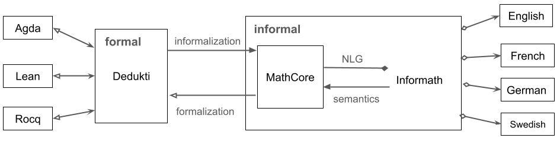

# Informath under the Hood

(c) Aarne Ranta 2025-2026

[Code repository](https://github.com/GrammaticalFramework/informath)

[Documents in github.io](https://grammaticalframework.github.io/informath/)

This document is a complement of the [README file of Informath](https://grammaticalframework.github.io/informath/).
It can be read independently to get an idea about the theory, but you can also start with installing the software and experimenting with it as described in the README.

## The Informath project

The Informath project addresses the problem of translating between formal and informal languages for mathematics. It aims to translate between multiple formal and informal languages in all directions: 

- formal to informal (**informalization**)
- informal to formal (**autoformalization**)
- informal to informal (translation, via formal)
- formal to formal (works in special cases)

The formal languages included are Agda, Rocq (formerly Coq), Dedukti, and Lean. The informal languages are English, French, German, and Swedish. 

Here is an example statement involving all of the currently available languages. The Dedukti statement has been used as the source of all the other formats. Also any of the natural languages could be used as the source:
```
Dedukti: prop110 : (a : Elem Int) -> (c : Elem Int) ->
  Proof (and (odd a) (odd c)) ->
  Proof (forall Int (b => even (plus (times a b) (times b c)))).

Agda: postulate prop110 : (a : Int) -> (c : Int) ->
  and (odd a) (odd c) ->
  all Int (\ b -> even (plus (times a b) (times b c)))

Rocq: Axiom prop110 : forall a : Int, forall c : Int,
  (odd a /\ odd c -> forall b : Int, even (a * b + b * c)) .

Lean: axiom prop110 (a c : Int) (x : odd a ∧ odd c) :
  ∀ b : Int, even (a * b + b * c)
```

- English: Prop110. Let $a$ and $c$ be integers. Assume that both $a$ and $c$ are odd. Then $a b + b c$ is even for all integers $b$.

- French: Prop110. Soient $a$ et $c$ des entiers. Supposons qu'et $a$ et $c$ sont impairs. Alors $a b + b c$ est pair pour tous les entiers $b$.

- German: Prop110. Seien $a$ und $c$ ganze Zahlen. Nimm an, dass sowohl $a$ als auch $c$ ungerade ist. Dann ist $a b + b c$ gerade für jede ganze Zahl $b$.

- Swedish: Prop110. Låt $a$ och $c$ vara heltal. Anta att både $a$ och $c$ är udda. Då är $a b + b c$ jämnt för alla heltal $b$.

More formalisms and informal languages will be added later. Also the scope of language structures is at the moment theorem statements and definitions; proofs are included for the sake of completeness, but will require more work to enable more natural verbalizations.


## The structure of Informath

The structure of Informath is shown in the following picture:



The diagram has four kinds of arrowheads. Solid ones mean that the operation is a total function, giving exactly one result for every input (triangular arrowheads) or possibly many (diamond). Hollow arrowheads mean partial functions which can likewise give at most one result (triangular) or many results (diamond):

 - Conversions from Dedukti to Agda, Rocq, and Lean are partial, because Dedukti is more permissive than these formalisms.
 - Conversion from MathCore to Dedukti may fail because MathCore is more permissive than Dedukti; this is because we delegate dependent type checking to Dedukti.
 - Conversion from MathCore to Informath is one-to-many, and always results in at least one value, the MathCore expression itself.
 - Conversions from English and other natural languages to Informath may fail, because the input is not covered by the grammar. They can also give many results, because the grammar accepts ambiguity; the idea is that ambiguity is ultimately checked on semantic grounds in Dedukti.

Conversions between MathCore and Informath, and extending the Informath language itself, are the most open-ended parts of the project and hence the main research focus. 

Conversions from Dedukti to Agda, Coq, and Lean and back are mostly engineering (although tricky in some cases) that has to a large extent been done for the kind of code needed in Informath. Conversions from these type theories to Dedukti rely on already existing third-party tools. Those tools are not always up to date with the latest versions of the systems, but they have their own development teams that have goals independent of Informath.

## Dedukti

[Dedukti](https://deducteam.github.io/) is a minimalistic logical framework aimed as an interlingua between different proof systems such as Agda, Rocq (formerly Coq), Isabelle, and Lean.
Its purpose is to help share formalizations between these systems.
Dedukti comes with an efficient proof checker and evaluator.
Translations from many other proof system to Dedukti have been built, and this work is ongoing.

Technically, Dedukti is described as an implementation of Lambda-Pi-calculus with rewrite rules.
It is similar to Martin-Löf's logical framework from the 1980's, except for a more liberal syntax of rewrite rules.
Thereby, it is also similar to the ALF system of 1990's and to the abstract syntax of GF, Grammatical Framework.

Due to its simplicity and expressivity, together with a powerful implementation and existing conversions from other formalisms, we have chosen Dedukti as the interlingua for formal proof systems.

### The syntax of Dedukti

The complete grammar of Dedukti used in Informath is defined in [Dedukti.bnf](./src/typetheory/Dedukti.bnf). In this section, we will give an overview aimed to help get started. 

Type theory, as defined for instance by [Martin-Löf 1979](https://www.cse.chalmers.se/~peterd/papers/MartinL%C3%B6f1979.pdf), has four **forms of judgement**:

- *A : Type*
- *A = B : Type*, where *A* and *B* are types
- *a : A*, where *A* is a type
- *a = b : A*, where *A* is a type and *a, b : A*

In Dedukti, all of these can be expressed syntactically by just two forms,
```
  a : A.
  def a : A := b.
```
because *Type* is itself a type. Dedukti also has some other forms of judgements, in particular
```
  [x, y, z ...] a := b.
```
for **rewrite rules**. They can be used for **definitions by cases**, where $a$ is a **pattern** that matches certain expressions where the variables $x, y, z, \ldots$ may occur. The `def` form of judgement is actually syntactic sugar for a combination of a typing judgement and a single rewrite rule without variables:
```
  def a : A.
  [] a := b.
```
The other forms of judgement in Dedukti, using keywords `thm` and `inj` instead of `def`, need not concern us here. They are only different in how they are handled in computations and not how they express mathematical content.

The parts of judgements are **expressions**, of some of the following forms:
```
  Ident                 (; variable, constant ;)
  Exp Exp               (; application ;)
  Ident => Exp          (; abstraction ;)
  (Ident : Exp) -> Exp  (; dependent function type ;)
  Exp -> Exp            (; non-dependent function type ;)
```
Comments in Dedukti are enclosed between `(;` and `;)`.

Here are some examples of how Dedukti has been used in Informath:
```
  Set : Type.
  Prop : Type.
  Elem : Set -> Type.
  Proof : Set -> Type.

  false : Prop.
  and : Prop -> Prop -> Prop.
  or  : Prop -> Prop -> Prop.
  if  : Prop -> Prop -> Prop.
  def not : Prop -> Prop := A => if A false.

  forall : (A : Set) -> (Elem A -> Prop) -> Prop.
  exists : (A : Set) -> (Elem A -> Prop) -> Prop.

  Num : Set.
  plus : Elem Num -> Elem Num -> Elem Num.
  Eq : Elem Num -> Elem Num -> Prop.
```
For more examples, we recommend to start with [BaseConstants.dk](./src/BaseConstants.dk).

## Agda, Rocq, and Lean

Agda, Rocq, and Lean are type-theoretical proof systems just like Dedukti. But all of them have a richer syntax than Dedukti, because they are intended to be hand-written by mathematicians and programmers, whereas Dedukti has an austere syntax suitable for automatic generation for code.

Translators from each of Agda, Rocq, and Lean to Dedukti are available, and we have no plans to write our own ones. However, translators from Dedukti to these formalisms are included in the current directory. They are very partial, because they only have to target fragments of the Agda, Rocq, and Lean. This is all we need for the purpose of autoformalization, if the generated code is just to be machine-checked and not to be read by humans.

However, if Informath is to be used as an input tool by Agda, Rocq, and Lean users, nice-looking syntax is desirable. In the case of Rocq and Lean, we have tried to include some syntactic sugar, such as infix notations. In Agda, this has not yet been done, because its libraries and the syntactic sugar defined in them are not as standardized as in Rocq and Lean.

Another caveat is that Dedukti is, by design, more liberal than the other systems. Type checking of code generated from type-correct Dedukti code can therefore fail in them. This can sometimes be repaired by inserting extra code such as coercions, but this is still mostly future work.

If you want to check the formal code in any of the proof systems, you must also install them. Informath itself does not require them, but at least Dedukti is useful to have so that you can check the input and output Dedukti code.

- [Dedukti](https://github.com/Deducteam/Dedukti)
- [Agda](https://agda.readthedocs.io/en/latest/getting-started/installation.html)
- [Rocq](https://rocq-prover.org/)
- [Lean](https://leanprover-community.github.io/get_started.html)


## Grammatical Framework


[Grammatical Framework, GF](https://www.grammaticalframework.org/) is itself based on a logical framework (LF). 
To put it briefly,

- GF = LF + grammar

If you are already familiar with GF, you can skip this section.
If not, it tries to give you the prerequisites needed to apply and extend the GF grammar of Informath.

### GF as a logical framework: abstract syntax

This framework is called **abstract syntax**, and it is to a large extent similar to Dedukti: it has both dependent types and variable bindings, enabling higher-order abstract syntax. Thus one *could* in GF define the types of sets and props and a universal quantifier just like in Dedukti:
```
abstract Logic = {
cat Set ;
cat Elem Set ;
cat Prop ;
cat Proof Prop ;
fun forall : (A : Set) -> (Elem A -> Prop) -> Prop ;
}
```
However, Informath grammars do not use all of these facilities, but only the fragmet known as **context-free abstract syntax**. 
In this syntax, the corresponding definitions look as follows:
```
abstract Logic = {
cat Set ;
cat Elem ;
cat Prop ;
cat Proof ;
cat Ident ;
fun forall : Set -> Ident -> Prop -> Prop ;
}
```
In this encodeing,
- the type dependencies (arguments of basic types) are omitted,
- abstractions are **flattened** to separate identifier and value arguments.

In this abstract syntax, a Dedukti expression of form
```
forall A (x => B)
```
is represented as
```
forall A x B
```
There are several reasons for using a context-free abstract syntax in Informath:
- grammar writing becomes more straightforward
- GF tools for dealing with dependent types and higher-order abstract syntax are less developed than for context-free abstract syntax
- ultimate type checking in Informath can be delegated to Dedukti and need not be performed in GF
- in this way, we can easily deal with overloading of expressions, which is ubiquitous informal mathematical language

In the above, we have already seen the syntax of GF's abstract syntax: it uses **modules** with the keyword `abstract` in the **header**, and has two forms of judgement:
```
cat C
fun f : T
```
where (in context-free abstract syntax), the type T is either a category $C$ of a function type $C \rightarrow T$, where many-place functions are dealt by currying, like in Dedukti.

### Concrete syntax

What makes GF into a grammar formalism is **concrete syntax**.
The simplest kind of concrete syntax is itself context-free: it consists of **linearization rules** that convert **abstract syntax trees** (terms of the logical framework) into strings. 
This happens in a **compositional** fashion: a complex tree is linearized by concatenating the linearizations of its subtrees.
The following GF module defines a concrete syntax for `Logic`:
```
concrete LogicEng of Logic = {

lincat Set = Str ;
lincat Elem = Str ;
lincat Prop = Str ;
lincat Ident = Str ;
lincat Proof = Str ;

lin forall set ident prop =
  "for all" ++ ident ++ "in" ++ set ++ "," ++ prop ;
}
```
The combination of the abstract syntax Logic with LogicEng is equivalent to a context-free grammar with the rule
```
Prop ::= "for all" Ident "in" Set "," Prop
```
In the opposite direction, the GF grammar can be seen as the result of taking apart **pure constituency** (the nonterminals) and **surface realization**. 
This operation has several advantages.
The most obvious one is perhaps that one can vary the concrete syntax while keeping the abstract syntax constant.
For example, a corrsponding French grammar is obtained by changing the linearization rule of `forall` to
```
lin forall set ident prop =
  "pour tout" ++ ident ++ "dans" ++ set ++ "," ++ prop ;
```
A **multilingual grammar** is a grammar with one abstract syntax and several concrete syntaxes.
It can be used for **translation** by parsing the source language into an abstract syntax tree and linearizing the tree into the target language.
The abstract syntax then functions as an **interlingua**.
Some of the languages could well be formal: a simple formalization and informalization system is obtained by writing a concrete syntax for the formal language:
```
lin forall set ident prop =
  "forall" ++ set ++ "(" ++ ident ++ "=>" ++ prop ++ ")" ;
```
This approach has been used in e.g. Ranta 2011 (CADE) and Pathak 2024 (GFLean). 
While it gives a simple way to convert between formal and informal languages, it is limited by compositionality.
Therefore, it cannot be used for languages with very different structures.
The approach followed in Informath is to have one abstract syntaxes for Dedukti and another one for Dedukti: surprisingly, natural languages are structurally close enough for this to work fine.

### Enriched concrete syntax

Much of the power of GF comes from not being context-free, but **mildly context-sensitive**.
This class of languages is more restricted than fully context-sensitive (in the Chomsky hierarchy sense) and enjoys polynomial worst-case parsing complexity.
It has turned out to be sufficient for almost any grammar-based analysis of natural languages, not only in GF but also with other formalisms such as TAG.

Some languages are strictly beyond context-free in the sense of weak generative capacity (generating the same sets of sentences).
A simple example that we can deal with already is the **copy language**, the set of sentences consisting of two copies of the same string, where strings have an arbitrary length.
In GF, this can be defined by the following simple rules:
```
cat S ;
fun copy : String -> S ;
lin copy s = s ++ s ;
```
using the built-in category `String` and leaving out the module structure.

A more interesting question, in practice, is to see what one can do when leaving the limits of the context-free rule format. 
This is in the first place expressed in the linearization types. 
Turning back to the `Logic` example, we can generalize the type of `Set` by making it dependent on a **parameter**, grammatical number, which has values singular and plural.
This makes it possible to give both "integer" and "integers" the same abstract syntax.
Some constructs will need the singular form, some the plural.

Again leaving out the module structure, we can write
```
param Number = Sg | Pl ;

lincat Set = Number => Str ;

lin forall set ident prop =
  "for all" ++ set ! Pl ++ ident ++ "," ++ prop ;
```
with a new form of judgement for parameter type definitions. 
They are in GF a special case of **algebraic datatypes** in languages like ML and Haskell.

The above grammar is still context-free in the weak generative sense, because the `Set` category can be expanded to two non-terminals.
But this will in general also require a duplication of rules, whole number in the worst case is the produce of the numbers of parameters in the types involved.
Like many other grammars that use parameters, GF gives a compact way to produce sets of context-free rules.

Since parameter definitions belong to the concrete syntax, they can be different for different languages.
French has also gender and mood, in addition to number:
```
param Number = Sg | Pl ;
param gender = Masc | Fem ;
param Mood = Ind | Subj ;

lincat Set = {s : Number => Str ; g : Gender} ;
lincat Prop = Mood => Str ;

lin forall set ident prop =
  \\m => "pour" ++ tout ! set.g ++ set.s ! Pl ++ ident ++ "," ++ prop ! m ;

oper tout : Gender => Str = table {Masc => "tout" ; Fem => "toutes"} ;
```
The context-free expansion of the `forall` rule would here produce four rules, for each combination of the two genders with the two moods.


### Summary of GF notation

While the abstract syntax notation of GF is familiar from logical frameworks, concrete syntax requires some explanations.
We have in the above code examples used or presupposed the following:

- **record types** e.g. ``{s : Number => Str ; g : Gender}``
- **table types** e.g. ``Gender => Str``
- **tables** (objects of table types), e.g. table {Masc => "tout" ; Fem => "toutes"} 
- **records** (objects of record types), e.g. ``{s = "ligne" ; g = Fem}``
- **selections** from table types, e.g. ``tout ! g``
- **projections** from record types, e.g. ``set.g``

This machinery - generalizing linearization types from strings with records and tables - has proven sufficient for many different languages, enabling them to share the same abstract syntax. 
The most substantial proof of this is the 
[GF Resource Grammar Library (RGL)](https://www.grammaticalframework.org/lib/doc/synopsis/index.html), which at the time of writing includes over 40 languages.
The main significance of RGL for GF applications, including Informath, is that *the programmer does not need to care about low-level linguistic features* such as parameters, but can use the library instead. 
In particular, the application programmer seldom needs to use the table and record syntax shown in this section, but mostly just function calls to the RGL.

### The GF Resource Grammar Library

The RGL is divided into two main parts:

- `Syntax<LANG>`, functions that form phrases from words and combine them
- `Paradigms<LANG>`, functions that generate inflection forms of words

In addition, there are some smaller libraries, which are also used in Informath:

- `Prelude`, basic operations on strings, analogous to Haskell's `Prelude`
- `Formal`, operations for formal expressions, such as definitions of infix, prefix, and postfix operators with different precedences
- `Symbolic<LANG>`, functions for using formal expressions as parts of verbal text

The suffix `<LANG>` it the 3-letter ISO-code for each language, e.g. `Eng` for English and `Fre` for French. 
Most GF grammar names use the same codes, but this is not built in in GF.

Starting with `Syntax`, the RGL provides a few dozen categories and functions.
The most important categories for Informath are the following:

- `Text`, texts, consisting of many sentences, such as those for proofs
- `S`, sentences, with fixed tense (in Informath, usually present ) and polarity (positive or negative)
- `Cl`, clauses, atomic sentences consisting of a predicate (such as a verb or an adjective) with its arguments (subject, object, complements), unspecified as for tense and polarity
- `VP`, verb prases, verbs with their argument
- `NP`, noun phrases, nouns with determiners and modifiers, with fixed number and gender
- `CN`, common nouns, noun phrases without determiners, with variable number (admitting different determiners) but fixed gender

The `Paradigms` functions build expressions of **lexical categories**, which contain individual words with their inflections and other properties such as gender and complement case:

- `N`, nouns
- `A`, adjectives
- `V`, verbs
- `V2`, two-place verbs (including transitive verbs)
- `Prep`, prepositions (in some languages, also cases)
- `Det`, determiners, such as "the", "every"

Expressions of each of these categories are constructed with **overloaded operations**, that is, sets of operations where the one and the same name is used for different types of functions. 
For ease of use and memory, the name of an RGL operation forming an expresion of category $C$ is almost always `mk`$C$ (almost because sometimes we need more than one operation of the same type).
Here are some that are widely used in Informath; for the full list, consult the [RGL synopsis](https://www.grammaticalframework.org/lib/doc/synopsis/index.html). 
The synopsis gives an API consisting of a name, a type and an example, as we will also do here, using examples from Informath:
```
mkText : S -> Text
mkText : Text -> Text -> Text

mkS : (Polarity) -> S

mkCl : NP -> VP -> Cl
mkCl : NP -> V -> Cl
mkCl : NP -> V2 -> NP -> Cl
mkCl : NP -> A -> Cl

mkVP : V -> VP
mkVP : V2 -> NP -> VP
mkVP : A -> VP

mkNP : Det -> CN -> NP

mkCN : N -> CN
mkCN : A -> CN -> CN

the_Det : Det
thePl_Det : Det
a_Det : Det
aPl_Det : Det
every_Det : Det
```


### Using the RGL


### Functors


## The MathCore language

The MathCore language is meant to be the "core abstract syntax" in Informath. Technically, it is actually a subset of Informath: Informath is implemented as an extension of MathCore.

As shown in the picture above, informalization and autoformalization are in the first place defined between Dedukti and MathCore. On the type theory side, this is composed with translations between other frameworks and Dedukti. On the natural language side, mappings between MathCore and the full Informath are defined on the abstract syntax level of these languages. Input and output of actual natural languages is performed by generation and parsing with concrete syntaxes of each language.

MathCore is a minimalistic grammar for mathematical language, based on the following principles:

- **Completeness**: all Dedukti code can be translated to MathCore.
- **Non-ambiguity**: all MathCore text has a unique translation to Dedukti.
- **Losslessness**: MathCore is a lossless representation of Dedukti; that is, all Dedukti code translated to MathCore can be translated back to the same Dedukti code (modulo some differences to be specified).
- **Traceability**: Dedukti code and MathCore text can be aligned part by part.
- **Grammaticality**: MathCore text is grammatically correct natural language (with mathematical symbols and some mark-up such as parentheses to prevent ambiguity).
- **Naturalness**: MathCore supports natural expressions for mathematical concepts using nouns, adjectives, verbs, and other structures conventionally used in mathematical text.
- **Minimality**: MathCore is defined to have exactly one way to express each Dedukti judgement. Alternative ways are provided in Informath via NLG. Typically, the unique way is the most straightforward one. For example, complex mathematical expressions are given in their verbal forms ("the sum of x and y") rather than formulas ("x + y"), because formulas are not available when any of the constituents if not formal ("x + the successor of y").
- **Extensibility**: MathCore can be extended with lexical information assigning natural language verbalizations to Dedukti identifiers.
- **Multilinguality**: MathCore has been implemented by GF RGL and is therefore ready for concrete syntax in new languages.

The following propertes are, however, *not* expected:

- **Type correctness**: MathCore text can be semantically invalid, leading to syntactically correct Dedukti code that is rejected by Dedukti's type checker.
- **Fluency**: MathCore text can be repetitive and hard to read; making it better is delegated to the Informath grammar via the NLG component.
- **Compositionality**: The translation between Dedukti and MathCore is not compositional in the strict sense of GF, as the two languages have distinxt abstract syntaxes. MathCore has a larger set of syntactic categories than Dedukti, for instance distinguishing between expressions that represent kinds, objects, propositions, and proofs.
- **Easy natural language input**: while the grammar of MathCore is reversible, it is tedious to write MathCore. It is intended to be produced indirectly: by conversion from Dedukti on one hand and from Informath on the other.

The rationale of this design is modularity and an optimal use of existing resources:

- Type checking is delegated to Dedukti.
- Conversions to different frameworks are also delegated to Dedukti.
- Variation of natural language input and output is delegated to Informath.


### The syntax of MathCore

The syntactic categories of MathCore are defined in the module [Categories](./grammars/Categories.gf). Here are some of the main ones:
```
category   name           linguistic type     example
—-------------------------------------------------------------------
Exp        expression     NP (noun phrase)    the empty set
Ident      identifier     Symb (symbol)       x
Jmt        judgement      Text                N is a set.
Hypo       hypothesis     Text                Assume A.
Kind       kind           CN (commoun noun)   integer
Prop       proposition    S (sentence)        2 is even
Proof      proof text     Text                By hypothesis h, B.
```
The "linguistic type" actually refers to a type in the [GF Resource Grammar Library (RGL)](https://www.grammaticalframework.org/lib/doc/synopsis/), which is used in the implementation of the grammars. The rough correspondences between Dedukti and MathCore are as follows:
```
Dedukti      MathCore
-----------------------------------
Exp          Exp, Kind, Prop, Proof
Hypo         Hypo
Ident        Ident
Jmt          Jmt
```
Thus Dedukti's `Exp` is divided between many categories of MathCore, and the task of the conversion is to decide which one to choose. This choice is based on **symbol tables**, which define mappings between Dedukti constants and MathCore functions. The symbol tables have entries such as
```
Int    integer_Noun
even   even_Adj
list   list_Fam
```
The left-hand side is a Dedukti constant and the right-hand side a MathCore function. These functions belong to some of the **lexical categories** of MathCore, which are listed in the following table:
```
category  semantic type              example
—-----------------------------------------------------------
Adj       Exp -> Prop                even
Adj2      Exp -> Exp -> Prop         divisible by
Adj3      Exp -> Exp -> Exp -> Prop  congruent to y modulo z
AdjC      Exps -> Prop               distinct (collective pred.)
AdjE      Exps -> Prop               equal (equivalence rel.)
Fam       Kind -> Kind               list of
Fam2      Kind -> Kind -> Kind       function from ... to
Fun       Exp -> Exp                 the square of
Fun2      Exp -> Exp -> Exp          the quotient of
FunC      Exps -> Exp                the sum of
Label     ProofExp                   theorem 1
Name      Exp                        the empty set
Noun      Kind                       integer
Noun1     Exp -> Prop                (a) prime
Noun2     Exp -> Exp -> Prop         (a) divisor of
Verb      Exp -> Prop                converge
Verb2     Exp -> Exp -> Prop         divide
```
The category `Exps` contains non-empty lists of expressions. The last two expressions are combined with the conjunction "and" and its equivalent in different languages.


## The full Informath language

While being inspired by CNLs such as ForTheL and Naproche, covering a similar fragment of English, the Informath grammar differs from the original them in several ways:

- **Grammaticality**: Informath follows the agreement rules of English (and other languages) instead of allowing free variation of e.g. singular and plural forms (as ForTheL and early versions of Naproche); this makes it more usable as the target of informalization.
- **Ambiguity**: CNLs prevent syntactic ambiguities by means of devices such as brackets and precedence rules. Informath tries to capture all syntactic ambiguities that exist in natural language, and delegates it to the logical framework to resolve them by semantic clues. This is in line with the findings in [*The language of Mathematics*](https://link.springer.com/book/10.1007/978-3-642-37012-0) by Mohan Ganesalingam.
- **LaTeX**: The original ForTheL is plain text, whereas Informath (like some other later versions of ForTheL) allows the full use of LaTeX similar to usual mathematical documents; this is one of the
- **Extensions**: Informath is open for extensions with new forms of expression when encountered in mathematical text. In ForTheL, new concepts can be defined, but the overall syntax is fixed. Because of the design of Informath, every extension should be equipped with a new semantic rule that converts it to MathCore.
- **Omissions**: Informath is not guaranteed to cover everything that occurs in different CNLs. In particular, constructs that differ from grammatical English are usually omitted.
- **Multilinguality**: Informath has several concrete syntaxes sharing a common abstract syntax.

### An example of variations

Consider again the example Dedukti statement used above:
```
Dedukti: prop110 : (a : Elem Int) -> (c : Elem Int) ->
  Proof (and (odd a) (odd c)) ->
  Proof (forall Int (b => even (plus (times a b) (times b c)))).
```
The MathCore informalization (in English) is one-to-one and verbose:

- Prop110. Let $a$ and $c$ be instances of integers. Assume that we can prove that $a$ is odd and $c$ is odd. Then we can prove that for all integers $b$, the sum of the product of $a$ and $b$ and the product of $b$ and $c$ is even.

MathCore renderings are designed to be unique for each Dedukti judgement. But the full Informath language recognizes several variations. Here are some of them for English, as generated by the system; other languages have equivalents of each of them:

- Prop110. For all integers $a$ and $c$, if $a$ is odd and $c$ is odd, then for all integers $b$, $a b + b c$ is even.
- Prop110. Let $a$ and $c$ be integers. Then if $a$ is odd and $c$ is odd, then for all integers $b$, $a b + b c$ is even.
- Prop110. Let $a , c \in Z$. then if $a$ is odd and $c$ is odd, then for all integers $b$, $a b + b c$ is even.
- Prop110. Let $a$ and $c$ be integers. Assume that $a$ is odd and $c$ is odd. Then for all integers $b$, $a b + b c$ is even.
- Prop110. Let $a , c \in Z$. assume that $a$ is odd and $c$ is odd. Then for all integers $b$, $a b + b c$ is even.
- Prop110. For all integers $a$ and $c$, if both $a$ and $c$ are odd, then for all integers $b$, $a b + b c$ is even.
- Prop110. Let $a$ and $c$ be integers. Then if both $a$ and $c$ are odd, then for all integers $b$, $a b + b c$ is even.
- Prop110. Let $a , c \in Z$. then if both $a$ and $c$ are odd, then for all integers $b$, $a b + b c$ is even.
- Prop110. Let $a$ and $c$ be integers. Assume that both $a$ and $c$ are odd. Then for all integers $b$, $a b + b c$ is even.
- Prop110. Let $a , c \in Z$. assume that both $a$ and $c$ are odd. Then for all integers $b$, $a b + b c$ is even.
Prop110. Let $a , c \in Z$. assume that both $a$ and $c$ are odd. Then $a b + b c$ is even for all integers $b$.


## User-defined extensions

_Under construction, may work in a different way in the future._

The lexicon part part of the GF grammar (files grammars/VerbalConstants*, SymbolicConstants*) give verbalizations to defined constants in .dk files.

The mapping between Dedukti and GF is defined in .dkgf files, by default in [baseconstants.dkgf](src/baseconstants.dkgf), which assigns GF functions to the constants in [BaseConstants.dk](src/BaseConstant.dk). The syntax of .dkgf files recognizes three kinds of lines;
- `<DeduktiIdent> <GFFunction>+`: different GF functions usable for expressing the Dedukti concept
- `#CONV <formalism> <DeduktiIdent> <FormalismIdent>`: conversion of Dedukti identifier to another formalism (e.g. its standard library function) 
- `#DROP <DeduktiIdent> <int>`: drop a number of initial arguments from the Dedukti function application

The coverage of Informath can be extended by writing a .dkgf file that maps Dedukti identifiers to GF functions. If those GF functions are already availeble, nothing else is needed than the inclusion of the flag `-constants=<file>.dkgf+` where `base_constants.dkgf`can be one of the files.

If new GF functions are defined, they have to be be included in [`UserExtensions`](./grammars/UserExtensions.gf), preferably via an extra module inherited by it. After that, the GF grammar has to be recompiled by 
```
$ make grammar
```
No recompilation of Haskell files is needed, as long as the UserConstants only include atomic functions of lexical categories, to be listed in next section. 

If other functions are included, both the grammar and the Haskell code can be compiled with the short command
```
$ make devel
```


### Categories of user-defined constants

The following categories of new verbal constants are currently supported by the grammar and listed in `.dkgf` files.

Every entry in a `.dkgf` file must have a verbal function as its primary rendering, given right after the Dedukti function. Alternative verbalizations can also come from symbolic categories:
```
  category    semantic type           example
—-------------------------------------------------------------------
  Compar      Term -> Term -> Term    <
  Const       Term                    \pi
  Oper        Term -> Term            \sqrt
  Oper2       Term -> Term -> Term    +
```

### Linearizations of user-defined constants

The easiest way to write linearization rules for constants is to use the `Utulities<Lang>` library module, whose API is given in the interface module [Utilities](./grammars/Utilities.gf). Many categories $C$ have a shortcut function
```
mkC : Str -> C
````
such that, for instance, one can define
```
lin integer_Noun = mkNoun "integer"
lin odd_Adj = mkAdj "odd"
```
However, more information is sometimes needed, particularly in languages other than English. A wider range of `mkC` functions is available for those cases, usually combining morphological functions from the standard RGL library `Paradigms<Lang>`. For instance, a possible rule for rational numbers in French is
```
lin rational_Noun = mkNoun (mkA "rationnel") (mkN "nombre" masculine)
```

### Functions of non-lexical categories

While it would be possible to define lexical categories for all possible semantic types and syntactic forms that appear in mathematics, this would clutter the grammar extensively and, what it worse, compel the user who wants to extend the language also to add compilation cases to the Haskell code. Because of this, Informath is being extended with the possibility to assign GF functions other than lexical ones to Dedukti constants in symbol tables.

These functions operate on the basic types of expressions, `Exp`, `Kind`, `Prop`, and `Proof`, as well as `Ident` when higher-order abstract syntax (variable bindings) are used in Dedukti. One advantage of this extension is that it eliminates the need to hard-code Dedukti identifiers in Haskell code. For example, the logical operators can now be mapped by means of symbol tables. In Dedukti we have
```
and : Prop -> Prop -> Prop.
```
In MathCore, we have
```
CoreAndProp : Prop -> Prop -> Prop
```
The symbol table entry is straightforward:
```
and    CoreAndProp
```
A bit more complicated is the treatment of variable bindings. In Dedukti, we can declare the universal quantifier as follows:
```
forall : (A : Kind) -> (B : ((x : Elem A) -> Prop)) -> Prop.
```
The corresponding GF function flattens the bound variable into an argument on the same level:
```
CoreAllProp : Kind -> Ident -> Prop -> Prop
```
The symbol table entry relies on the correspondance between these types:
```
forall   CoreAllProp
```
This generalization of symbol table is still an experimental feature of Informath.

